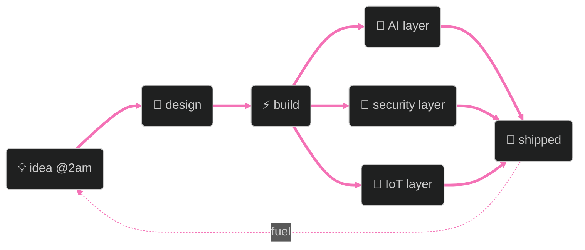

<div align="center">



<br/>


<br/><br/>


</div>

<br/>


## `01`  signal

I build at the intersection of things that most people keep separate — AI models talking to irrigation sensors, blockchain ledgers hunting ransomware, terminals that grow into full platforms. I'm from **Malawi 🇲🇼**, and I care about systems that hold up under real-world conditions: bad connectivity, adversarial actors, users who've never seen your interface before.


## `02`  how the pieces connect




## `03`  arsenal

<div align="center">


</div>

<br/>

<table>
<tr><td valign="top" width="50%">

**core languages**


**frontend & design**


</td><td valign="top" width="50%">

**backend & infra**


**AI · chain · hardware**


</td></tr>
</table>


## `04`  things I've shipped

<details open>
<summary><b>🧠 Nexus Echo</b> — AI Learning & Productivity Ecosystem &nbsp;<a href="https://nexusecho.vercel.app/web">↗ live</a></summary>
<br/>

Notes go in messy. A structured knowledge graph, study paths, and project ideas come out.

`React` `AI APIs` `Firebase` `Node.js`
</details>

<details>
<summary><b>🌱 LIMA</b> — AI + IoT for Smallholder Farmers</summary>
<br/>

Soil and weather sensors feed a model that tells farmers when and how much to irrigate — delivered over SMS/USSD, because the people who need this most don't have 4G.

`React` `Flask` `Arduino` `Raspberry Pi` `Machine Learning`
- Real-time soil moisture & weather integration
- ML-powered irrigation recommendations
- SMS/USSD support for low-connectivity users
</details>

<details>
<summary><b>🔐 Blockchain Ransomware Defense</b> — Decentralized Threat Forensics</summary>
<br/>

Watches, flags, and reacts to ransomware in real time, then seals the evidence into an immutable blockchain audit trail via IPFS.

`Python` `Blockchain` `IPFS` `Smart Contracts` `Brownie` `ML`
- Real-time behavioral anomaly detection
- PowerShell-level threat scanning
- Automated email/SMS alerting
</details>

<details>
<summary><b>🎓 What Happened Uni</b> — Campus Communication Platform &nbsp;<a href="https://whu.onrender.com/">↗ live</a></summary>
<br/>

Announcements, events, and real-time community pulse for a university campus.

`React` `Firebase`
</details>

<details>
<summary><b>🌐 Structuralabs.io</b> — AI Workflow Ecosystem <i>(in development)</i></summary>
<br/>

Growing from a terminal-style AI tool into a fully configurable platform for wiring together models, APIs, and automated workflows.

`custom API connections` `multi-model config` `workflow automation`
</details>


## `05`  activity

<div align="center">


</div>

<div align="center">

</div>

<div align="center">

<!-- snake animation: see snake.yml — renders here once the workflow has run once -->


</div>


## `06`  operating principles

```diff
+ full-spectrum   →  frontend, backend, infra, hardware, AI — one builder, no handoffs
+ security-first  →  resilience isn't a feature I add later, it's the foundation
+ dev × designer  →  architecture and experience are the same problem to me
+ curiosity-fed   →  I prototype first and ask permission never
+ fast absorption →  new stack drops → shipped in it within the week
```


## `07`  contact.exe

<div align="center">

[](https://github.com/bigmphatso)
[](https://www.linkedin.com/in/mphatso-misinde-912707298)
[](mailto:mpha2berg@gmail.com)

</div>


